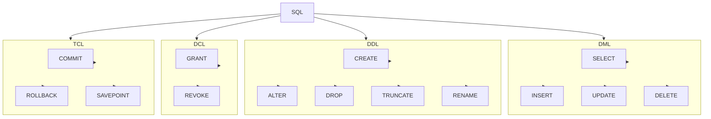

# sql_snippets



```mermaid
flowchart TD
    SQL["SQL"]
    SQL --> DML["DML"]
    SQL --> DDL["DDL"]
    SQL --> DCL["DCL"]
    SQL --> TCL["TCL"]

    subgraph DML
      SELECT["SELECT"]
      INSERT["INSERT"]
      UPDATE["UPDATE"]
      DELETE["DELETE"]
    end
    DML --> SELECT
    DML --> INSERT
    DML --> UPDATE
    DML --> DELETE

    subgraph DDL
      CREATE["CREATE"]
      ALTER["ALTER"]
      DROP["DROP"]
      TRUNCATE["TRUNCATE"]
      RENAME["RENAME"]
    end
    DDL --> CREATE
    DDL --> ALTER
    DDL --> DROP
    DDL --> TRUNCATE
    DDL --> RENAME

    subgraph DCL
      GRANT["GRANT"]
      REVOKE["REVOKE"]
    end
    DCL --> GRANT
    DCL --> REVOKE

    subgraph TCL
      COMMIT["COMMIT"]
      ROLLBACK["ROLLBACK"]
      SAVEPOINT["SAVEPOINT"]
    end
    TCL --> COMMIT
    TCL --> ROLLBACK
    TCL --> SAVEPOINT

```

### `LAST_DAY`
Returns last day of the month
```sql
SELECT LAST_DAY('2026-02-10'::DATE);
```
Returns: `2026-02-28`
